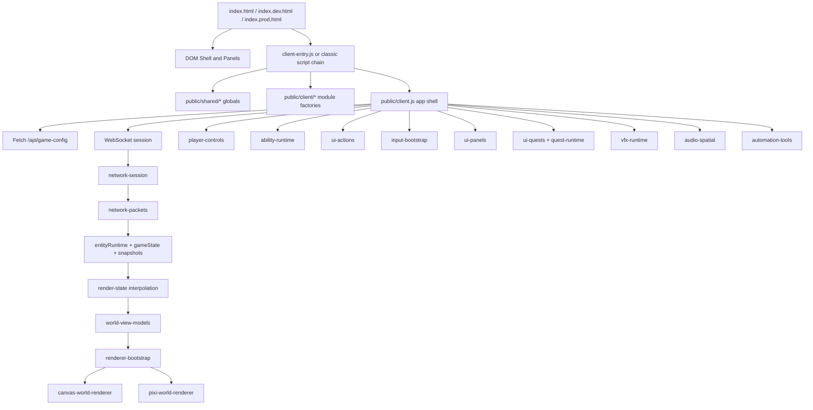

# Client Architecture

## Overview

The browser client is a DOM-first, canvas-rendered game application with a thin modular layer growing around an older monolithic app shell. The authoritative game state lives on the server; the client is responsible for joining a session, receiving state snapshots, interpolating motion, rendering the world, collecting local input, and presenting UI such as inventory, quests, chat, talents, and debug tools.

At a high level:

- `public/index*.html` defines the DOM shell, HUD, and panels.
- `public/client.js` still owns most live client state and a large amount of glue code.
- `public/client/*.js` contains factory-style modules attached to `globalThis`.
- `/api/game-config` provides bootstrap data such as classes, abilities, items, sounds, gameplay config, and equipment metadata.
- WebSocket carries join, movement, abilities, inventory, quests, chat, and live world updates.
- Binary packets are used for the high-frequency world stream.
- The render path interpolates snapshots, builds a frame view model, and draws through either a canvas renderer or a Pixi renderer.
- There is no frontend framework runtime. The app is assembled from plain JavaScript modules, global namespaces, and direct DOM manipulation.

## Topology

## Directory Responsibilities

| Path | Responsibility |
| --- | --- |
| `public/client.js` | Main browser app shell, runtime state, message handlers, and subsystem wiring |
| `public/client-entry.js` | Module-based bootstrap for the modular client path |
| `public/client/` | Factory-style subsystems for networking, rendering, input, UI, audio, automation |
| `public/shared/` | Shared protocol constants, codecs, layout helpers, math utilities, and render metadata |
| `public/index.html` | Classic script-loaded browser shell |
| `public/index.dev.html` | Module-entry development shell using `client-entry.js` |
| `public/index.prod.html` | Production shell using the bundled asset |
| `public/styles.css` | HUD, panel, mobile, chat, quest, and debug styling |
| `public/vendor/pixi.min.js` | Optional Pixi renderer runtime |

## Boot Modes

There are currently multiple client boot paths in the repo:

- `public/index.dev.html` loads `pixi.min.js` and then `client-entry.js` as an ES module.
- `public/index.html` loads the shared scripts and client modules individually in classic script order, then loads `client.js`.
- `public/index.prod.html` loads `pixi.min.js` and a bundled `app.bundle.min.js`.

This matters because the architecture is in a transition state. The modular code under `public/client/` is real and used, but the app still depends on global names and the large `public/client.js` shell.

## Process Model In The Browser

### 1. HTML shell first

The HTML files define almost the entire UI upfront:

- join screen
- canvas
- HUD labels
- resource bars
- action bar
- inventory, equipment, spellbook, talent, crafting, vendor, DPS, chat, quest, and debug panels
- mobile joystick and mobile utility controls
- bot/admin panels and gear-lab tools

This is not a virtual-DOM application. Most UI state changes happen by mutating these existing DOM nodes directly.

### 2. Shared globals are loaded before app code

`client-entry.js` first imports shared helpers and publishes them on `globalThis`, such as:

- protocol constants and codecs
- ability visual registries
- vector, number, and object helpers
- ability stat helpers
- summon and town layout utilities
- humanoid and mob render-style metadata

The same global contract is also respected by the classic script path.

### 3. Modular factories are loaded before the shell

The modules in `public/client/` mostly follow the same pattern:

- wrap code in an IIFE
- export a `create*Tools()` factory onto a global namespace
- accept all dependencies as plain objects
- return small tool bundles instead of classes

This is effectively a hand-rolled dependency injection system layered on top of browser globals.

### 4. `public/client.js` still acts as the composition root

Even with the newer module set, `public/client.js` still does the heavy lifting:

- caches DOM elements
- owns mutable client state objects
- fetches initial config
- constructs subsystem dependencies
- defines WebSocket message handlers
- wires panel updates, rendering, audio, quests, chat, admin actions, and automation helpers
- binds startup and shutdown behavior for a session

The easiest mental model is: `public/client/*.js` contains reusable subsystems, while `public/client.js` is the live application that assembles them.

## Startup Sequence

### 1. DOM and constants initialize

When `client.js` runs, it immediately captures references to the canvas, join form, HUD nodes, panel roots, chat widgets, debug controls, mobile controls, and admin tools. It also defines core constants such as:

- tile size
- interpolation delay
- snapshot cap
- traffic window
- render radii and sprite sizing
- inventory layout sizes

### 2. Local runtime state is created

The client maintains several categories of local state:

- `gameState` for currently visible world entities and self state
- `entityRuntime` for normalized runtime maps keyed by entity ID
- `snapshots` for interpolation history
- panel/UI state such as inventory, equipment, talents, chat, DPS, and debug
- transient runtime state for ability channels, floating damage, explosions, audio loops, tooltips, automation, and mobile controls

### 3. Initial config is fetched

`loadInitialGameConfig()` requests `/api/game-config` with `cache: "no-store"` and applies:

- class and ability definitions
- gameplay client config
- equipment config
- item definitions
- sound manifest

This step gives the client enough metadata to render tooltips, build the action bar, and understand incoming world state.

### 4. Network session is created on join

`connectAndJoin()` uses `network-session` to open a WebSocket to the same host. Once the socket opens, the client sends the join payload with player name, class, and admin flag.

### 5. `welcome` transitions the app into live play

On the `welcome` message:

- `myId` is assigned
- `selfStatic` is established
- map and visibility settings are updated
- talent tree and skill metadata are applied
- client session state is reset for a clean live world
- the join screen is hidden and the game UI is shown
- default action bindings are regenerated for the selected class

From that point on, the app is in the real-time simulation loop.

## Runtime Data Model

### Authoritative live state mirrors

The client keeps world data in a few layers:

- `entityRuntime` stores normalized maps keyed by string ID
- `gameState` stores array-shaped structures convenient for rendering
- `snapshots` stores timestamped render snapshots for interpolation

This split lets the client receive sparse deltas efficiently while still rendering array-friendly views.

### `gameState`

`gameState` is the current browser-side picture of the visible world. It includes:

- `self`
- `players`
- `mobs`
- `projectiles`
- `lootBags`
- `resourceNodes`
- map and visibility metadata

It is not the full server world. It is the local, visible slice the player needs to render.

### `entityRuntime`

`entityRuntime` is a denormalized store that preserves richer runtime information, such as:

- player metadata
- mob metadata
- projectile metadata
- loot-bag metadata
- resource-node metadata
- self progression details like level, copper, skills, and ability levels

The binary packet layer updates these maps, and helper functions sync them back into `gameState`.

### Snapshot history

`snapshots` contains timestamped world frames capped by `MAX_SNAPSHOTS`. Each snapshot contains the entity arrays needed for render interpolation. The client never renders raw network deltas directly; instead it renders a slightly delayed interpolated state.

## Network Architecture

### HTTP bootstrap plane

The initial content plane is a simple fetch to `/api/game-config`. That payload provides the definitions needed to interpret UI and world data before or during session startup.

### WebSocket session plane

`public/client/network-session.js` owns the socket session wrapper. It is responsible for:

- choosing `ws:` or `wss:` based on the page protocol
- creating the socket
- marking binary frames as `arraybuffer`
- counting traffic for debug metrics
- parsing JSON messages
- forwarding binary payloads to the binary packet parser
- dispatching messages to a `messageHandlers` map

`client.js` supplies the actual message handlers and the socket lifecycle callbacks.

### Join and session lifecycle

Important JSON messages include:

- `hello`
- `welcome`
- `error`
- `inventory_state`
- `equipment_state`
- `resource_nodes_state`
- quest and dialogue updates
- admin/bot responses
- chat messages and system responses

The client also responds to disconnects by resetting runtime state and showing the join screen again.

### Binary protocol path

`public/client/network-packets.js` parses the high-frequency binary stream. It understands multiple protocol families, including:

- entity snapshots and deltas
- mob effects
- area effects
- player, mob, projectile, and loot metadata
- damage, cast, swing, bite, explosion, projectile-hit, and mob-death events

The parser updates `entityRuntime`, applies transient effect state, and pushes snapshots for later interpolation.

### Outbound message flow

`client.js` and its helper modules send commands back to the server through JSON payloads such as:

- `move`
- `use_ability`
- `update_cast_target`
- `pickup_bag`
- `use_item`
- quest interaction and dialogue messages
- vendor, crafting, and inventory operations
- chat messages
- admin and bot commands

The client is not authoritative over simulation. It proposes actions and renders the authoritative results the server sends back.

## Rendering Architecture

### Render-state interpolation

`public/client/render-state.js` provides `createRenderStateInterpolator()`. It:

- keeps a sliding render window delayed by `INTERPOLATION_DELAY_MS`
- blends positions between consecutive snapshots
- interpolates `self`, players, projectiles, mobs, loot bags, and resource nodes

This is the main smoothing layer between bursty network updates and continuous rendering.

### World frame view-model layer

`public/client/world-view-models.js` turns an interpolated snapshot into a richer frame model for rendering. It computes:

- camera position from `self`
- player views, including cast and status overlays
- mob views, including attack and status overlays
- projectile views with ability-specific renderer hooks
- loot bag and resource-node views
- explosion and floating-damage views
- area effects
- hovered entities for tooltip presentation
- town vendor and quest NPC overlays

This layer is the boundary between raw state and render-ready scene data.

### Render loop

`public/client/render-loop.js` owns the `requestAnimationFrame` loop. Each frame it:

1. records frame timing for debug metrics
2. updates channeling state
3. resolves the interpolated state
4. clears the canvas if there is no active self
5. stores the last render state
6. builds the world frame view model
7. renders the frame through the active renderer
8. updates resource bars, action bar UI, and HUD labels

The render loop is also responsible for compact HUD behavior on small screens.

### Renderer bootstrap

`public/client/renderer-bootstrap.js` is the abstraction layer between the two renderer implementations. It:

- reads renderer preference from the query string or `localStorage`
- chooses `canvas` or `pixi`
- falls back to canvas if Pixi is unavailable
- applies visibility changes to the backing canvas
- exposes `renderWorldFrame()`, `resize()`, and renderer debug stats

### Canvas renderer

`public/client/canvas-world-renderer.js` is the immediate-mode fallback renderer. It draws:

- background and grid
- ability cast previews
- projectiles
- explosions
- area effects under and over entities
- town vendor and quest NPCs
- resource nodes and loot bags
- mobs with attack, cast, and status visuals
- floating damage numbers
- nearby players and self
- hover tooltips

It also updates spatial audio hooks and tracks coarse debug counts for what was rendered.

### Pixi renderer

`public/client/pixi-world-renderer.js` is the retained-mode renderer with many explicit layers and caches. It manages:

- background, underlay, overlay, projectile, loot, mob, player, vendor, quest-NPC, tooltip, and particle layers
- sprite pools
- canvas-to-texture caches
- humanoid runtime caches
- floating-damage text pooling
- particle emitters and projectile particles

This path is more complex but designed for richer visuals and better batching than the canvas renderer.

### Renderer-specific helpers

The render stack is supported by smaller specialized modules:

- `render-humanoids.js`
- `render-mobs.js`
- `render-players.js`
- `render-projectiles.js`
- `particle-system.js`
- `pixi-particle-system.js`

These modules encapsulate character animation, mob visuals, projectile sprites, and ambient particle behavior.

## Input And Action Architecture

### Player controls

`public/client/player-controls.js` owns movement vector calculation and coordinate conversion. It combines:

- keyboard movement
- mobile joystick movement
- auto-move targets for contextual interactions
- screen-to-world mapping based on camera center and tile size

Movement is sent only when the vector changes, which keeps the wire protocol leaner than sending on every frame.

### Ability runtime

`public/client/ability-runtime.js` tracks local ability usage state, including:

- cooldown timing
- cast channel state
- mana checks
- cast target updates
- charge-specific targeting state
- local audio hooks
- sword swing triggers and other client-side effects

This module decides whether an ability can be attempted locally and keeps the presentation layer in sync until the server confirms the authoritative result.

### UI action bindings

`public/client/ui-actions.js` maps input slots to actions or items. It handles:

- default class bindings
- `mouse_left`, `mouse_right`, and hotbar slots
- item vs ability bindings
- cooldown/channel overlay state for the action bar
- execution of abilities, item use, and loot pickup

### DOM event binding

`public/client/input-bootstrap.js` binds the actual browser events:

- keyboard movement and panel toggles
- mouse movement, click, and context menu behavior
- touch controls and mobile joystick logic
- resize and blur handling
- startup join form behavior

It also coordinates auto-interactions for vendors, quests, resource nodes, and loot bags.

## UI And Gameplay Presentation

### Panel and metrics layer

`public/client/ui-panels.js` manages visibility and metric updates for panels such as:

- inventory
- spellbook
- talents
- debug
- DPS

It also tracks frame samples and network traffic windows so the debug panel can show FPS, bandwidth, mob counts, and renderer stats.

### Quest UI

`public/client/ui-quests.js` owns:

- quest log rendering
- quest tracker rendering
- dialogue rendering
- quest notifications
- quest-NPC marker state

This is the main DOM presentation layer for the quest system.

### Quest runtime

`public/client/quest-runtime.js` manages the world-side quest interaction rules:

- detecting nearby or hovered quest NPCs
- starting auto-move toward quest NPCs
- sending `quest_interact` and `talk_to_npc`
- tracking quest interaction state
- bridging quest UI actions back into world interactions

### VFX runtime

`public/client/vfx-runtime.js` maintains transient visual-only state such as:

- floating damage numbers
- explosion events
- active area-effect visuals

These effects are short-lived presentation artifacts layered on top of the authoritative entity state.

### Spatial audio runtime

`public/client/audio-spatial.js` manages Web Audio behavior. It is responsible for:

- lazily creating the audio context
- resuming it on user interaction
- loading and caching one-shot buffers
- distance-based gain and stereo panning
- looped spatial sources
- event throttling and cleanup

Audio is positioned relative to the local player and updated from gameplay events like mob casts and projectile flight.

## Automation, Debug, And Admin Surface

### Debug UI

The debug panel exposes operational metrics and renderer controls. It can show:

- traffic over a 10-second window
- FPS
- current mob count
- renderer-specific stats

It also includes renderer switching and admin-only controls for bots and gear labs.

### Automation bridge

`public/client/automation-tools.js` exposes a browser automation surface for local testing and smoke scripts. It can:

- inspect renderer and debug metrics
- snapshot game, quest, inventory, and equipment state
- dispatch mouse and touch events against world coordinates
- toggle panels or invoke actions through the installed API

This is effectively the local test harness bridge between browser automation and the running game UI.

### Admin and bot controls

`client.js` also includes a set of privileged UI paths for:

- creating bot players
- listing and inspecting bots
- sending bot commands
- opening the debug gear lab

These are regular client features gated by admin state coming from the server.

## Shared Client/Server Contract

The client depends heavily on `public/shared/` for stable cross-runtime contracts:

- protocol constants and wire formats
- binary codec helpers
- ability visual metadata
- stat formulas
- summon formation helpers
- town layout helpers
- render-style metadata

This shared folder is the glue that keeps the browser and Node server speaking the same protocol and rendering the same content definitions consistently.

## Architectural Characteristics And Tradeoffs

### Strengths

- No framework overhead and very direct control over rendering and input.
- Clear separation between authoritative server state and client presentation.
- Reasonably modular rendering, input, quest, network, and automation subsystems.
- Supports both a simple canvas renderer and a richer Pixi renderer.
- Shared protocol and content helpers reduce duplication between client and server.

### Current complexity points

- `public/client.js` is still very large and remains the effective composition root.
- The codebase currently supports multiple boot styles, which increases maintenance overhead.
- Global namespaces are convenient but make dependency flow less explicit than a formal module system would.
- Many UI panels are updated through manual DOM mutation, which is simple but easy to couple tightly to runtime state.

## Practical Mental Model

If you need to reason about the client quickly, use this sequence:

1. HTML builds the static shell and panels.
2. Shared helpers and client factories are loaded.
3. `client.js` creates runtime state and wires every subsystem.
4. `/api/game-config` provides the content metadata.
5. WebSocket join establishes the live session.
6. Binary and JSON messages update `entityRuntime` and `gameState`.
7. Snapshots are interpolated for smooth motion.
8. A frame view model is built and rendered through canvas or Pixi.
9. Input, quests, chat, admin tools, and automation all feed back into the same app shell.

That is the core client architecture: a server-driven MMO browser runtime, assembled from plain JavaScript modules, direct DOM control, and a rendering pipeline that sits between raw network state and player-facing presentation.
