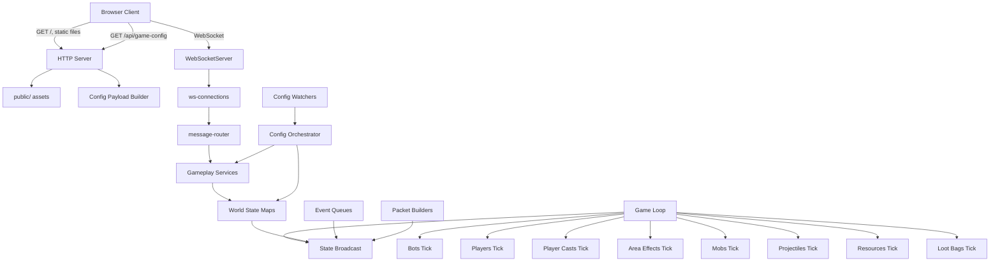
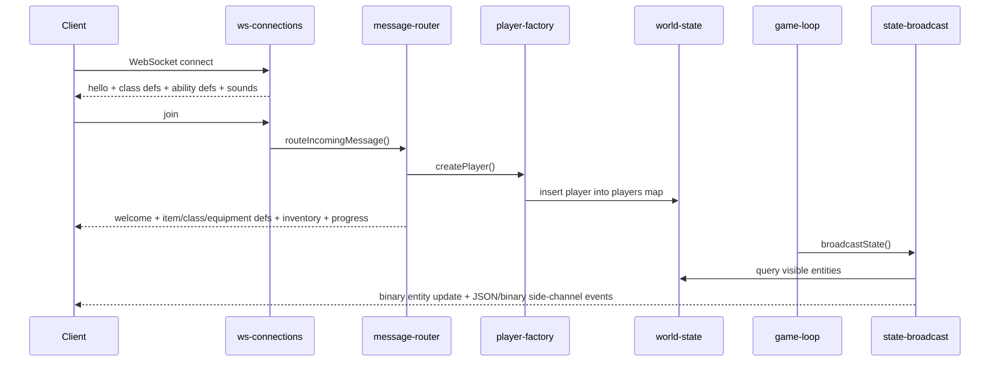

# Server Architecture

## Overview

This server is a single-process, in-memory, authoritative Node.js game runtime. The entire composition root lives in `server.js`, which loads data/config, creates domain services, wires networking, starts file watchers, and boots the simulation loop.

At a high level:

- HTTP serves the web client and `/api/game-config`.
- WebSocket carries player input and live game state.
- All runtime state lives in JavaScript `Map` collections owned by `createWorldState()`.
- The simulation runs on a fixed tick via `setInterval`.
- Gameplay behavior is data driven from `config/*.json` and `data/*.json`.
- There is no database or persistent runtime storage. Restarting the process resets the world.

## Topology

## Directory Responsibilities

| Path | Responsibility |
| --- | --- |
| `server.js` | Composition root and bootstrapping |
| `server/runtime/` | Loop orchestration, mutable runtime services, world state, bots, ticks |
| `server/network/` | HTTP/WS transport, routing, packet encoding, visibility broadcast |
| `server/gameplay/` | Domain logic for combat, items, quests, resources, mobs, crafting, talents |
| `server/ability-handlers/` | Ability-kind specific execution (`projectile`, `area`, `beam`, `charge`, etc.) |
| `server/config/` | Loaders/parsers for JSON-driven content and server tuning |
| `server/utils/` | Generic helpers such as ID normalization and quadtree |
| `public/shared/` | Client/server shared protocol constants, layouts, numeric helpers |
| `config/` | Mutable runtime config, especially `config/server.json` and `config/gameplay.json` |
| `data/` | Content definitions for items, classes, mobs, abilities, quests, skills, resources, recipes |

## Process Model

### 1. Composition root

`server.js` does all startup wiring:

1. Reads environment such as `PORT` and `APP_MODE`.
2. Loads gameplay constants from `config/gameplay.json` through `loadGameplayRuntimeConfig()`.
3. Builds the town layout from shared layout helpers in `public/shared/town-layout`.
4. Loads mutable server config from `config/server.json`.
5. Loads core data sets: items, equipment, abilities, classes, mobs, quests, resources, recipes, talents, skills, biomes, drop tables.
6. Creates reusable service bundles such as `coreServices`, `equipmentTools`, `vendorTools`, `questTools`, `resourceGenerationTools`, `mobLifecycleTools`, and combat/effect tools.
7. Creates the HTTP server and WebSocket server on the same underlying port.
8. Creates `worldState`, which owns all live entity maps and spatial indexes.
9. Builds the runtime bootstrap object, which registers WebSocket handlers and the main game loop.
10. Starts config watchers, initializes world content, listens on the port, and then starts ticking.

### 2. Single-process simulation

There is no worker pool or sharding layer. The server is a single event-loop process:

- simulation is driven by `createGameLoop()` in `server/runtime/game-loop.js`
- state mutation is synchronous and in-process
- network ingress and egress happen on the same runtime
- any expensive scan or blocking file read impacts the same process

### 3. No persistence layer

Runtime entities are ephemeral:

- players, mobs, projectiles, loot bags, resources, area effects, and spawners live in memory
- there is no database-backed character save
- file-backed data is content/config only
- restarting the process reconstructs the world from content files and loses live state

## Startup Sequence In Detail

### Configuration and content loading

There are two different kinds of inputs:

- `config/*.json` contains runtime tuning knobs such as map size, tick rate, rate limits, and payload limits
- `data/*.json` contains content definitions such as abilities, classes, items, mobs, quests, resources, and recipes

Important loaders:

- `loadGameplayRuntimeConfig()` reads gameplay constants used all over the process
- `loadServerConfigFromDisk()` parses mutable server settings such as XP multipliers, WS rate limits, proxy header trust, and WebSocket payload cap
- `loadAbilityConfigFromDisk()`, `loadClassConfigFromDisk()`, `loadItemConfigFromDisk()`, `loadMobConfigFromDisk()`, and related loaders turn JSON into in-memory maps and client-facing defs

### Core services bundle

`createCoreServices()` centralizes several cross-cutting services:

- player messaging helpers
- inventory operations
- heal/mana over time resource logic
- progression and XP formulas
- skill loading and serialization
- talent-system creation
- drop rolling and global drop logic

This bundle is deliberately reused by higher-level systems instead of re-implementing common behavior.

### World initialization

`createWorldState()` creates the shared mutable world:

- `players`
- `projectiles`
- `mobSpawners`
- `mobs`
- `lootBags`
- `resourceNodes`
- `activeAreaEffects`

It also owns runtime ID allocators and quadtree-backed spatial indexes for:

- players
- mobs
- loot bags
- projectiles

Those indexes are queried during broadcast and are available for other runtime queries.

## Runtime Data Model

### Entity collections

The world is centered on `Map` collections keyed by string IDs:

- `players`: authoritative player entities and their live input/combat state
- `mobs`: live NPC enemies, including combat state and spawn affiliation
- `projectiles`: active moving projectiles and emitter children
- `lootBags`: dropped item containers in the world
- `resourceNodes`: gatherable nodes such as trees or ore
- `activeAreaEffects`: persistent ground, beam, and summon effects
- `mobSpawners`: spawn anchors and cluster metadata

### Player state

Player entities are created by `createPlayerFactory()` and combine:

- identity and socket reference
- class and stat state
- inventory/equipment
- resource pools (`hp`, `mana`)
- ability cooldowns and cast state
- active buffs and combat effects
- viewport-derived visibility extents
- per-recipient sync bookkeeping under `entitySync`

### Per-recipient sync state

Every player keeps an `entitySync` object used by the delta protocol:

- slot assignment maps for players, mobs, projectiles, and loot bags
- last known states for delta compression
- metadata signatures to suppress duplicate meta packets
- self-state and effect signatures

This lets the server send a compact binary snapshot instead of resending full entity records every tick.

## Network Architecture

### HTTP plane

`createGameHttpServer()` serves:

- static files from `public/`
- `/api/game-config`, which returns client bootstrap data such as classes, abilities, items, equipment metadata, audio, and selected gameplay config

The HTTP server also guards against path traversal by resolving requests inside `publicDir`.

### WebSocket plane

`WebSocketServer` is created directly in `server.js` with:

- the shared HTTP server
- `maxPayload` sourced from `SERVER_CONFIG.wsMaxPayloadBytes`

`registerWsConnections()` in `server/network/ws-connections.js` handles:

- connection acceptance
- per-address connection rate limiting
- per-connection message rate limiting
- optional trusted-proxy handling for `X-Forwarded-For`
- initial `hello` message
- cleanup on close

### Dependency injection into WS handlers

`createWsConnectionDeps()` builds the object passed into connection/message handling. It exposes:

- current class/ability/item configs
- player creation and bot/admin operations
- inventory/equipment/crafting/vendor/resource helpers
- talent and quest helpers
- message senders and world references

This is the bridge between the network layer and the gameplay/domain layer.

### Message routing

`routeIncomingMessage()` in `server/network/message-router.js` is the main command router.

Core message families include:

- session: `join`, `viewport`
- movement/combat: `move`, `use_ability`, `update_cast_target`, `cast`, `melee_attack`
- progression: `level_up_ability`, `spend_talent_point`, `get_talent_tree`
- inventory/equipment/items: `pickup_bag`, `inventory_move`, `equip_item`, `unequip_item`, `use_item`
- world interactions: `interact_resource`, `craft_recipe`, `sell_inventory_item`
- chat: `chat_message`
- quests/dialogue: `quest_interact`, `talk_to_npc`, `quest_select_option`, `abandon_quest`
- admin/dev: `admin_grant_equipment_item`, `admin_grant_item`, `admin_set_level`, `admin_complete_quest`, `create_bot_player`, `admin_spawn_benchmark_scene`, `admin_list_bots`, `admin_inspect_bot`, `admin_destroy_bot`, `admin_command_bot_follow`

The router validates shape, ensures the player has joined before using most commands, and delegates to domain-specific helpers.

### Transport formats

Outbound transport is mixed:

- JSON for command replies, UI state, chat, quest updates, inventory/equipment, and some meta payloads
- binary packets for high-frequency entity and animation updates

`server/network/transport.js` provides the low-level `sendJson()` and `sendBinary()` helpers.

## Visibility and Broadcast Pipeline

### Visibility model

Visibility is not a single fixed radius for all players. `createPlayerVisibilityTools()` derives extents from client viewport width/height:

- `visibilityRangeX`
- `visibilityRangeY`

The server stores these on the player and uses them during broadcast.

### Broadcast builder

`createStateBroadcaster()` wraps `broadcastStateToPlayers()`.

Per broadcast tick it:

1. rebuilds spatial indexes from `worldState`
2. gathers nearby entities for each player using quadtree radius queries
3. applies precise visibility filtering with `inVisibilityRange`
4. builds binary entity updates via `createEntityUpdatePacketBuilder()`
5. sends supporting packets/events such as meta packets, area effects, buffs, damage bursts, explosions, projectile hits, mob deaths, and world stats

### Entity packet builder

`server/network/entity-update-packet.js` is the binary delta engine. It:

- assigns compact 1-byte slots per visible entity
- tracks previously sent state in `player.entitySync`
- emits full updates for first sighting
- emits deltas when movement/HP/state changed
- emits removals when entities leave visibility
- keeps meta signatures separate from hot movement deltas

### Event queues

`createWorldEventQueues()` accumulates short-lived cosmetic/combat events:

- damage numbers
- explosions
- projectile hit flashes
- mob death events

The tick systems enqueue these, and the broadcaster flushes only the events visible to each player.

## Simulation Loop

`createRuntimeBootstrap()` assembles the simulation and starts it after the HTTP server begins listening.

The loop order is fixed:

1. `tickBots(now)`
2. `tickPlayers()`
3. `tickPlayerCasts(now)`
4. `tickAreaEffects(now)`
5. `tickMobs()`
6. `tickProjectiles()`
7. `tickResources(now)`
8. `tickLootBags(now)`
9. `broadcastState(now)`

That order matters:

- bots feed input into player state first
- players move and regenerate before cast completion is checked
- area effects can modify mobs before mob AI runs
- projectiles resolve after entities have updated positions
- broadcast happens after all state mutations for the frame

## Gameplay Architecture

### Abilities

Ability execution is split between:

- `server/gameplay/player-commands.js` for command-time validation and cast scheduling
- `server/runtime/player-tick.js` for cast completion and movement-time player updates
- `server/ability-handlers/*.js` for ability-kind behavior
- `createAbilityHandlerContext()` for shared services passed into handlers

Supported ability kinds currently include:

- `meleeCone`
- `projectile`
- `area`
- `beam`
- `chain`
- `summon`
- `selfBuff`
- `teleport`
- `charge`

### Damage and combat effects

Combat is spread across a few focused tools:

- `createDamageTools()` applies damage, queues damage events, provokes mobs, and handles deaths
- `createMobCombatEffectTools()` and `createPlayerCombatEffectTools()` apply stun/slow/dot side effects
- `createProjectileEffectTools()` applies projectile hit effects
- talent hooks are wired back into damage/effect flows after the talent system is constructed

### Projectiles and area effects

Projectile handling is split into:

- `createProjectileSpawnTools()` for authoritative projectile creation
- `createProjectileRuntimeTools()` for homing target selection and projectile emitters
- `createProjectileTickSystem()` for travel, collision, splash, expiry, and deletion

Area effects are managed by `createAreaEffectTools()`:

- persistent circles
- beams
- summon effects

These are stored in `activeAreaEffects` and tick independently of the player who created them.

### Players

`createPlayerTickSystem()` owns recurring player-side simulation:

- regen
- heal/mana over time
- buff and dot processing
- stun/slow/burn cleanup
- movement
- charge interpolation and impact
- collision resolution against mobs

`tickPlayerCasts()` completes casted abilities when their timers expire.

### Mobs

Mob behavior is layered:

- `createMobLifecycleTools()` manages spawners, spawning, despawning, respawning, drops, and observed-area logic
- `createMobBehaviorTools()` manages leashing, returning home, speed, and provoked chase windows
- `createMobCombatTools()` picks targets and attack profiles
- `createMobTickSystem()` runs the AI each frame

The mob tick handles:

- observed-spawner maintenance
- dot ticking
- ability cast completion
- town/leash constraints
- aggro, ranged, melee, and flee behavior
- overlap resolution between mobs

### Resources, crafting, vendor, and loot

Economic/world interaction subsystems are separate modules:

- `createLootBagTools()` creates and expires dropped loot bags
- `createResourceGenerationTools()` deterministically seeds gatherable nodes, handles interaction, and respawns depleted nodes
- `createCraftingTools()` loads recipes, validates requirements, crafts outputs, and sends results
- `createVendorTools()` handles proximity checks and inventory sales for copper

### Quests and dialogue

Quests are split into:

- `createQuestTools()` for quest state, objective progress, rewards, procedural quest generation, and NPC lookup
- `createDialogueTools()` for dialogue graphs, quest offer/accept/complete flows, and dialogue state per player

Quest state is piggybacked onto progress updates through `sendSelfProgressWithQuests()`.

### Bots and benchmark scenes

The server includes built-in automation/dev helpers:

- `createBotTickSystem()` controls bot behavior, auto-looting, auto-equipping, combat, vendor trips, and follow commands
- `createBenchmarkSceneTools()` can clear the world, spawn controlled bot squads, and spawn dense mob formations for testing/perf scenarios

## Content and Config Hot Reload

Runtime config reload is a first-class subsystem.

`createConfigOrchestrator()` manages live reloading for:

- server config
- ability config
- class config
- mob config

`startConfigWatchers()` starts file watchers, and `createDebouncedFileReloader()` debounces disk-change events.

Important behavior:

- server config reload updates tuning knobs in place
- ability/class reload broadcasts fresh class and ability defs to connected players
- mob reload re-applies definitions to live mobs and spawners

This means a lot of balance/content iteration can happen without restarting the process.

## Join To Broadcast Flow

## Extension Points

The main extension seams are:

- add a new ability kind: implement a handler in `server/ability-handlers/` and register it in `server/ability-handlers/index.js`
- add new content: extend the relevant JSON in `data/` and, if needed, the corresponding loader in `server/config/`
- add a new network command: extend `routeIncomingMessage()` and expose required dependencies through `createWsConnectionDeps()`
- add new replicated state: update entity serializers, packet encoders, and the state broadcaster
- add new world simulation: wire a new subsystem into `server.js` and place its tick in `createRuntimeBootstrap()`

## Operational Characteristics

Some practical truths about this architecture:

- It is authoritative: clients request actions, but the server decides outcomes.
- It is stateful and in-memory: process restarts wipe live world state.
- It is data-driven: most gameplay content is loaded from JSON, not hard-coded.
- It is modular at the service level, but `server.js` remains the main composition root.
- It uses shared modules under `public/shared/` to keep protocol constants and some layout/math logic aligned with the client.
- Performance depends heavily on keeping hot paths in the tick loop and broadcaster efficient because everything runs in one process.

## Testing Surface

Server tests live under `server/__tests__/` and currently focus on:

- config parsing
- quadtree/world state behavior
- state broadcast behavior
- rate limiting
- quests and some gameplay flows

There are also Playwright-backed quest/debug tests in the same tree, which are separate from the pure Jest unit-style tests.

## Practical Mental Model

If you need a concise way to reason about the server, use this:

1. `server.js` is the only real composition root.
2. `worldState` is the source of truth for all live entities.
3. `message-router` converts inbound client commands into domain mutations.
4. `tick*` systems advance the simulation.
5. `state-broadcast` turns authoritative state into per-client snapshots and events.
6. `config-orchestrator` keeps content and balancing mutable without full restarts.

That model is accurate enough to navigate almost every server change in this repository.
